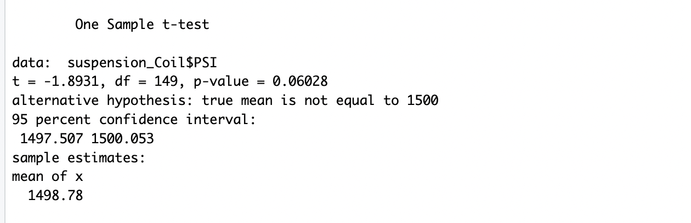
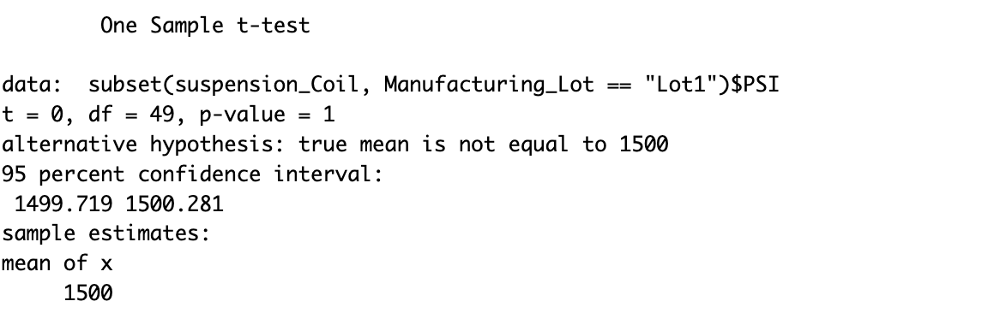
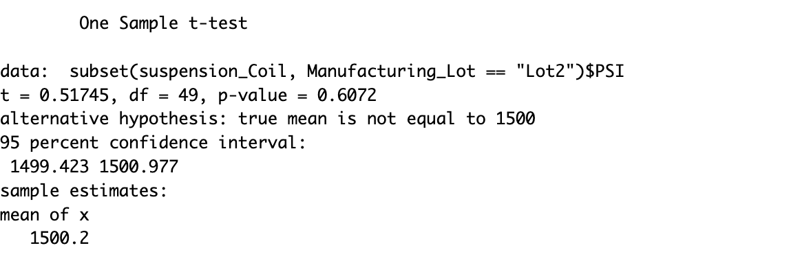
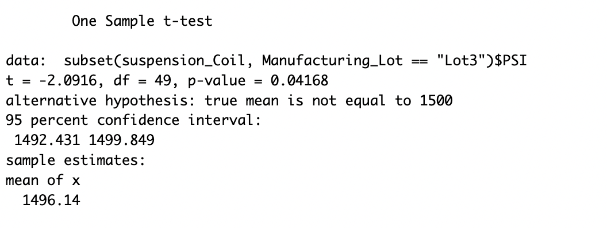

# MechaCar_Statistical_Analysis
The coefficents that provided a non-random amount of variance to the mpg values in that data set are: vehicle legnth (5.08e-08), vehicle weight (2.60e-12) and ground clearance (5.21e-08).  
The slope of the linear model is considered to not be zero because the coefficents are not equal to 0.  
The p-value of our linear regression analysis is 5.35e-11, much smaller than our significance level of 0.05%. There's enough evidance to reject the null hypothesis which means that the slope of our linear model is not zero.   

## Summary Statistics on Suspension 
The current manufacturing data meets the design specification of variance within 100 pounds when you look at the total. The variance for the manufacturing total is 62.29. Although, when we're able to group by specifics lots we can see where the problem lies. The variance for Lot1 is 0.97, for Lot2 7.46 and for Lot 3 170.26, which means Lot 3 does not have variance of <100 pounds. 

## T-Tests on Suspension Coils 
For the one sample t-test including all three manufacturing lots the results show the test has no statistical difference between the observed mean and the population mean. The p value =0.06, which is greater than the cut off of 0.05.  

 
For the t-test for Lot 1, the p value is equal to 1. This means the null hypothesis is correct once again, and the population mean is equal to the sample mean of Lot 1.  

 
Regarding Lot 2, the significance is equal to 0.6072,  meaning the population mean is equal to the sample mean. Fail to reject the null hypothesis. 

 
The significance for Lot 3 is statistically significant with a p value equal to 0.04168. This means that the population mean is not equal to the sample mean. Reject the null hypothesis.  

 

## Study Design: MechaCar vs Competition 

The metrics that we would assess is cost per year of maintenance for a MechaCar compared to the average cost per year for car maintenance.  
Null Hypothesis: There is no difference is in the mean maintenance price per year for a MechaCar compared to the mean of maintenance cost for a vehicle.  
Alternative Hypotheis: There is a difference in the mean maintenance price per year for a MechaCar compared to the mean of maintenance cost for a vehicle.   
The statistical test I would use to test the hypothesis is a two tailed t test to check if there is a difference in the means and if so in which direction. The data that is needed to run the statistical test is the average maitenance cost for MechaCar and the average cost of maintenance for vehicles. 
